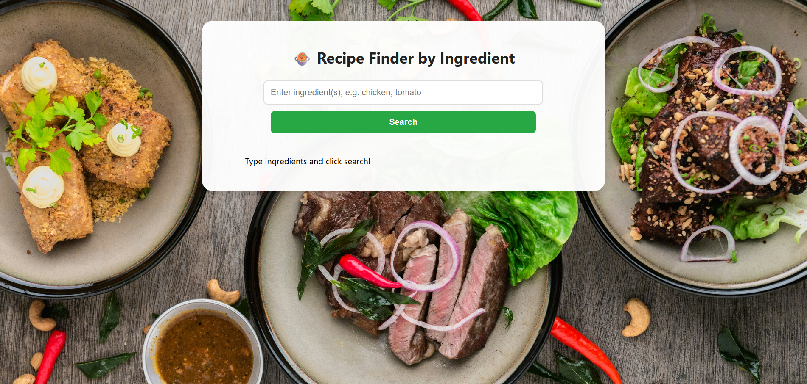
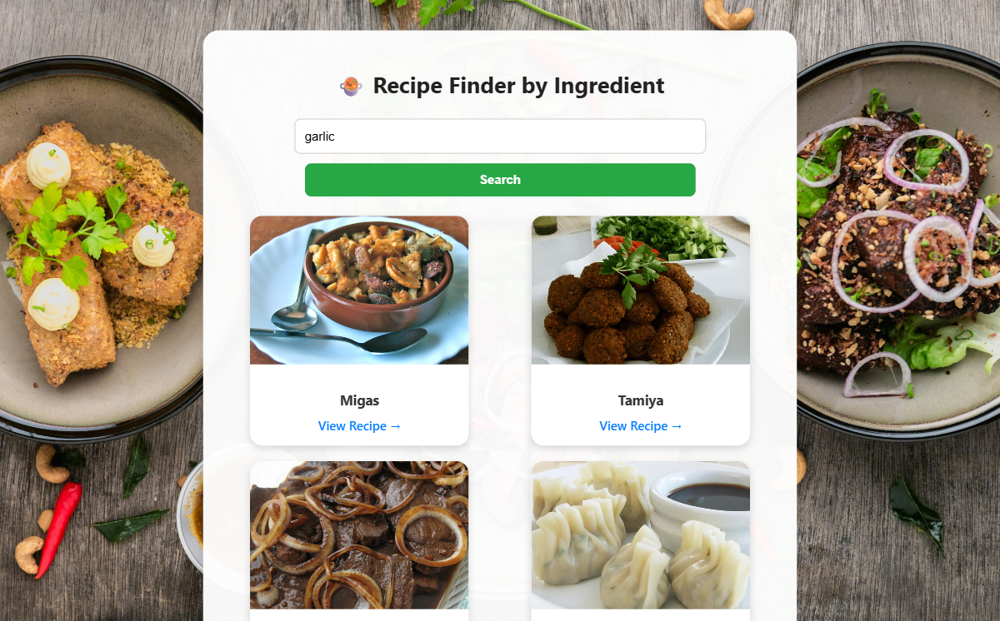
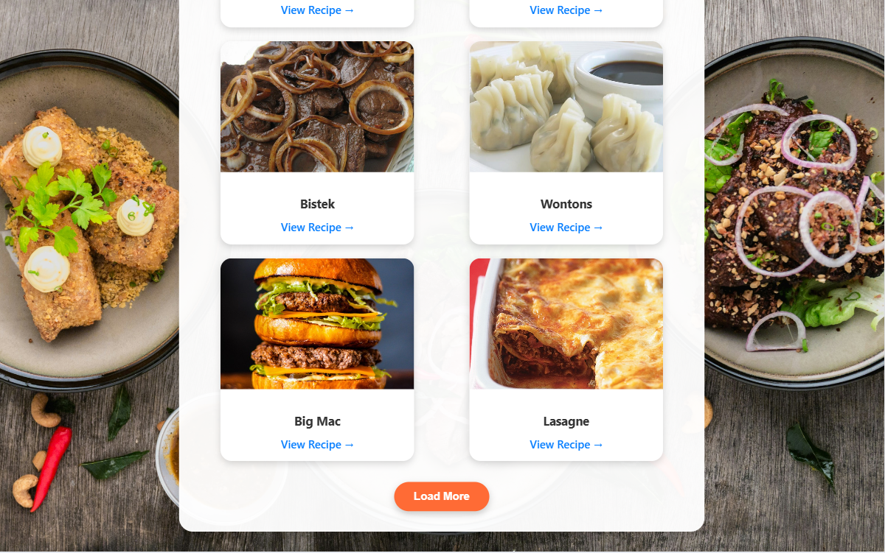
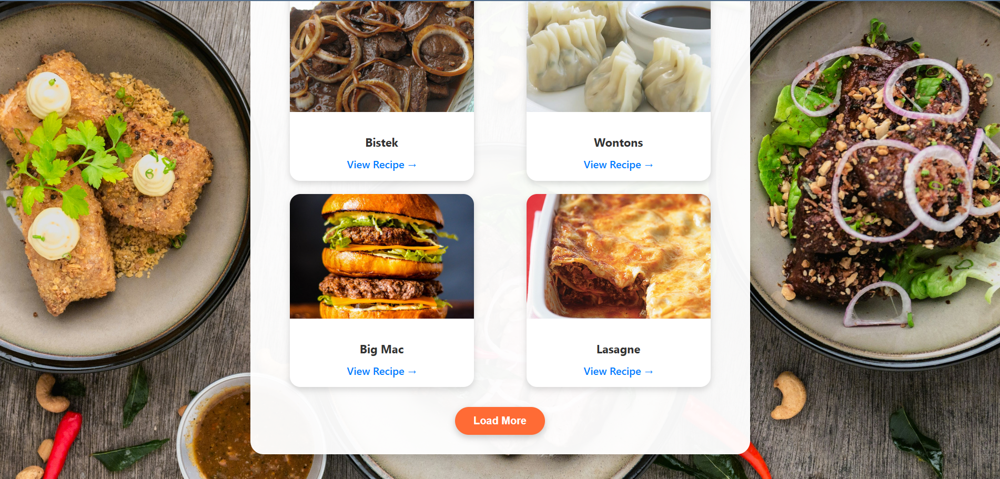
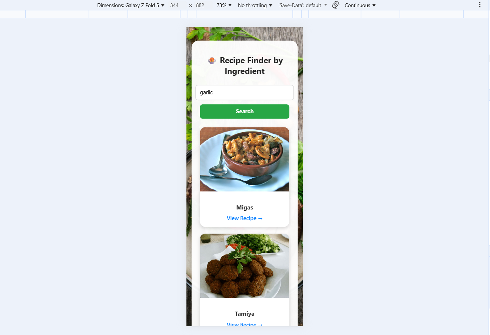
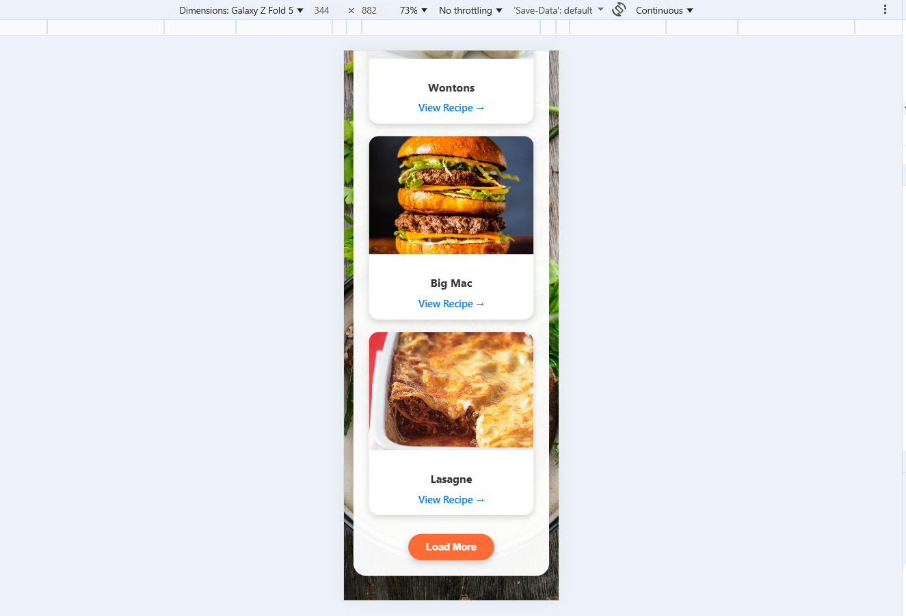

# 🍲 IngreDish — Recipe Finder by Ingredients

**IngreDish** helps you discover delicious recipes using ingredients you already have at home.  
Just enter one or more ingredients (e.g., `egg, rice, tomato`) — and instantly get a list of dishes you can cook!

---

## ✨ Features

- 🔍 Search recipes by **single or multiple ingredients**
- 🧠 Intelligent filtering using **TheMealDB API**
- 🧾 View details of each recipe
- 📱 Fully **responsive design**
- 🪄 Smooth card hover animations
- ➕ “Load More” functionality for large results

---

## 🧩 Tech Stack

| Category | Technologies |
|-----------|---------------|
| **Frontend** | React.js |
| **Styling** | CSS3, Flexbox, Grid |
| **API** | [TheMealDB API](https://www.themealdb.com/api.php) |
| **Version Control** | Git, GitHub |

---

## 🖼️ Screenshots

### 🏠 Home & Search Results
| Home | Results |
|------|----------|
|  |  |
|  |  |

---

### 📱 Responsive Design
| Responsive Layout 1 | Responsive Layout 2 |
|----------------------|----------------------|
|  |  |


## ⚙️ How to Run Locally

1. Clone the repository:
   ```bash
   git clone https://github.com/Vijayalakshmiboya/IngreDish.git
   cd IngreDish
Install dependencies:

bash
Copy code
npm install
Start the app:

bash
Copy code
npm start
Open your browser and visit:

arduino
Copy code
http://localhost:3000
📁 Project Structure
pgsql
Copy code
IngreDish/
│
├── public/
├── src/
│   ├── App.js
│   ├── App.css
│   ├── index.js
│   └── 1.jpg
│
├── screenshots/
│   ├── home.png
│   ├── result1.png
│   ├── result2.png
│   ├── loadmore.png
│   ├── responsiveness1.png
│   ├── responsiveness2.png
│
├── package.json
├── README.md
└── .gitignore
🌟 Future Enhancements
🧂 Add filters for cuisine, category, or difficulty

⭐ Allow users to save favorite recipes

🌙 Add a dark mode

📊 Include nutritional information

👩‍💻 Author
B. Vijayalakshmi
📧 vijayalakshmiboya97@gmail.com
🔗 GitHub Profile

❤️ Crafted with passion using React.js


---

### ✅ Next Steps
1. Copy the above and save it as **`README.md`** inside your `app/` folder.  
2. Then run these commands:
   ```bash
   git add README.md
   git commit -m "Added compact portfolio-style README with screenshots"
   git push origin main
